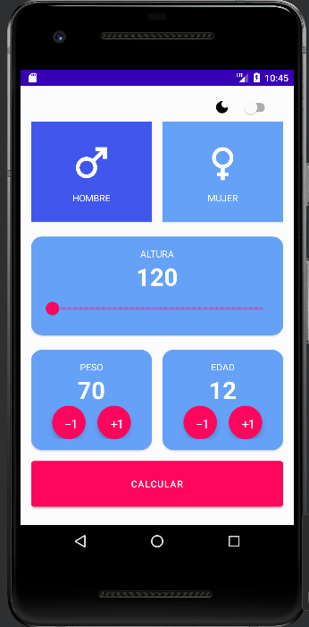
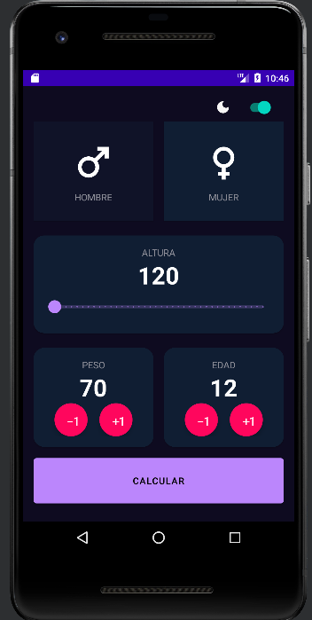
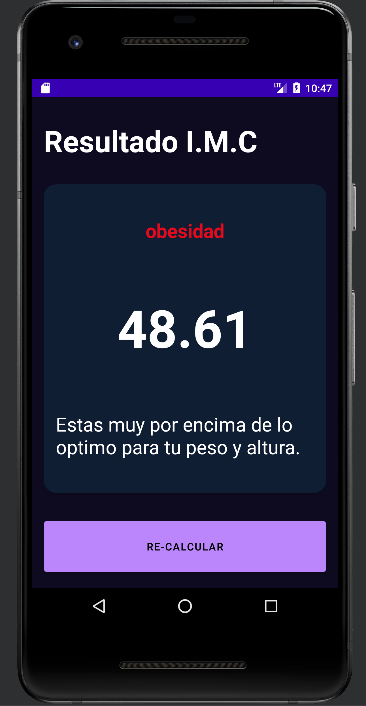

# IMC APP🏋️‍♀️🏋️‍♂️

## My Android project is a body mass index (BMI) calculator application. It helps you calculate your BMI, providing you with a valuable tool to assess your body composition and overall health. By entering your height and weight, the app will determine your BMI and provide you with an interpretation of the result. Stay informed about your body's health and make informed decisions for a healthier lifestyle with this BMI calculator app.


## characteristics

- Layout with XML
- Data storage for persistence
- Dark mode


## Installation:

```
Dependencies{
    implementation "androidx.datastore:datastore-preferences:1.0.0"
}
```


# Layout

## Presentation


## DarkMode

## Result View

